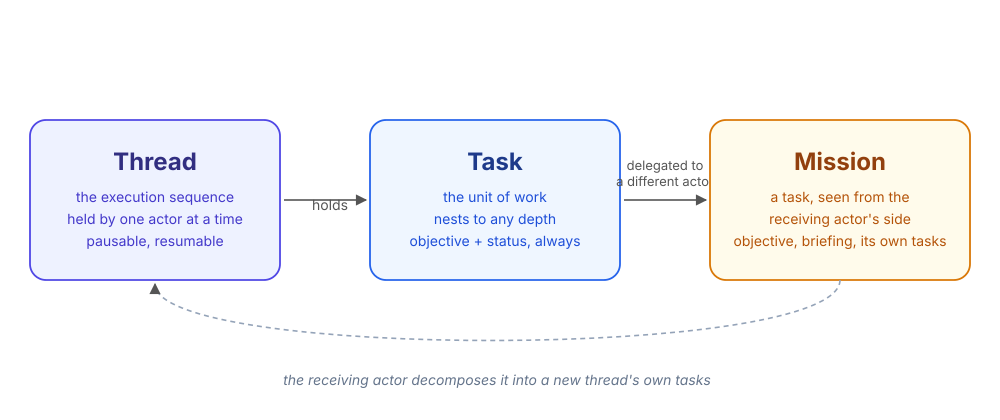
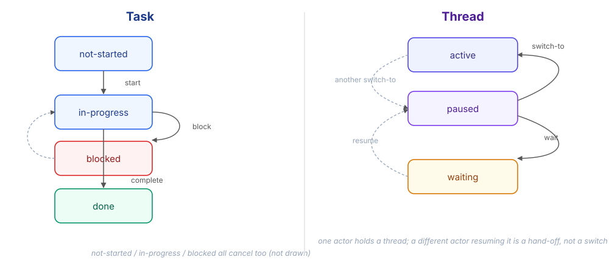
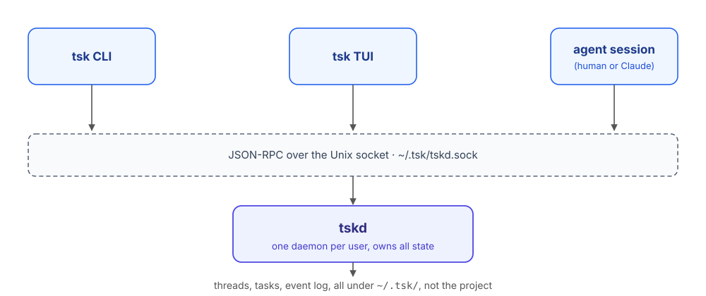
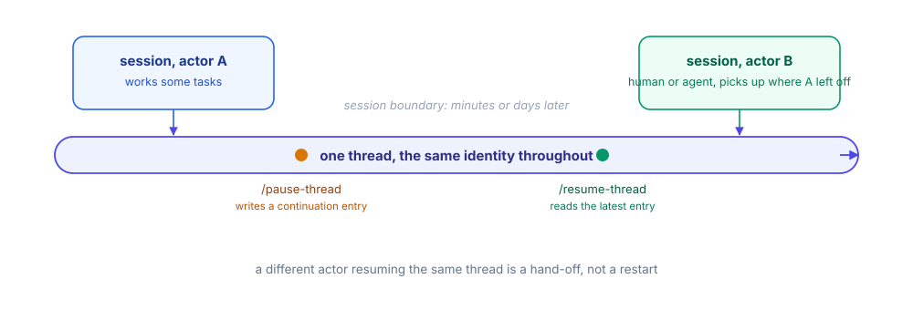
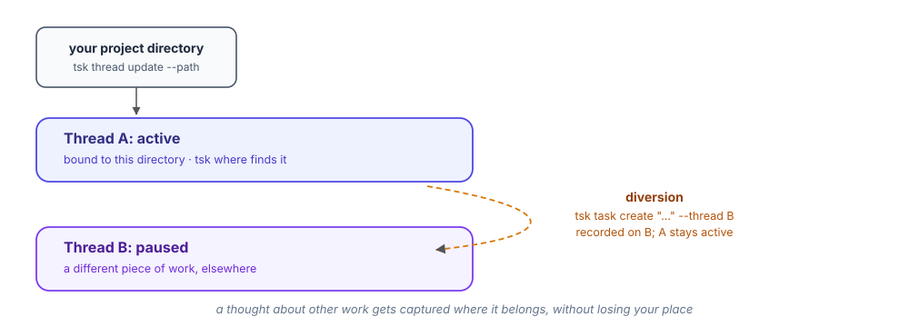

<!-- _class: lead -->
<!-- _paginate: false -->
<!-- _footer: "" -->

# tsk

A working model for how software delivery gets tracked, for humans and agents together.

<!--
tsk is a task and mission tracker built on a small, well-defined domain model
rather than a generic ticket with process bolted on. This deck covers what is
built and usable today. The closing slide links to the wider research thesis
behind it.
-->

---

# Three objects, not a generic ticket

- **Thread**: the execution sequence. Held by one actor at a time.
- **Task**: the unit of work. Nests to any depth.
- **Mission**: a task, once delegated to a different actor.

<!--
Delegation, not assignment, is what turns a task into a mission: every task
on an agent's own list has an assignee already, and none of them is a
mission. Most tasks never become one.
-->

---

# Lifecycles are explicit, not implied by a label

<!--
Both state machines are enforced by the daemon, not left to convention. A
task cannot silently sit "in progress" forever with no record of why: it
moves to blocked, or it moves to done.
-->

---

<!-- _class: dense -->

# One daemon, several clients

- `tskd` runs once per user and owns all state: an append-only event log plus a queryable cache.
- CLI, TUI and an agent session talk to it over the same JSON-RPC socket, concurrently, with state under `~/.tsk/`, outside any one project.

<!--
The TUI watches ~/.tsk/threads/index.json for changes and re-renders live: a
change made by the CLI, or by an agent, shows up in the TUI without a manual
refresh.
-->

---

<!-- _class: dense -->

# A thread survives the session that started it

- Pausing writes a continuation entry: the task in progress, and a short account of what to do next. Resuming reads it and reports where things stand, then asks before continuing.
- A different actor can pick up someone else's thread. That is a hand-off, recorded as such, not a silent takeover.

<!--
This is what lets a person hand a thread to an agent, or one agent session
hand off to its successor, without reconstructing context from a chat
transcript each time.
-->

---

<!-- _class: dense -->

# Fits how you actually move between things

- A thread can bind to a project directory: `tsk where` finds it, and `tsk` auto-zooms to it from inside that directory.
- Priorities (`BG`, `PRIO`, `INC`) triage which thread needs attention first.
- A diversion records a thought against a different thread without switching your active one.

---

<!-- _class: lead -->

# What's built is Navigation

tsk today tracks threads, tasks and missions: the map and the route.

The wider bet is a model that also joins Delta, Product and Scale into the same structure.

[docs/vision.md](https://github.com/jimbarritt/tsk/blob/main/docs/vision.md)

<!--
Closing slide. One link forward, deliberately not elaborated here: the
vision document carries the four-dimension thesis and the open research
questions behind it.
-->
